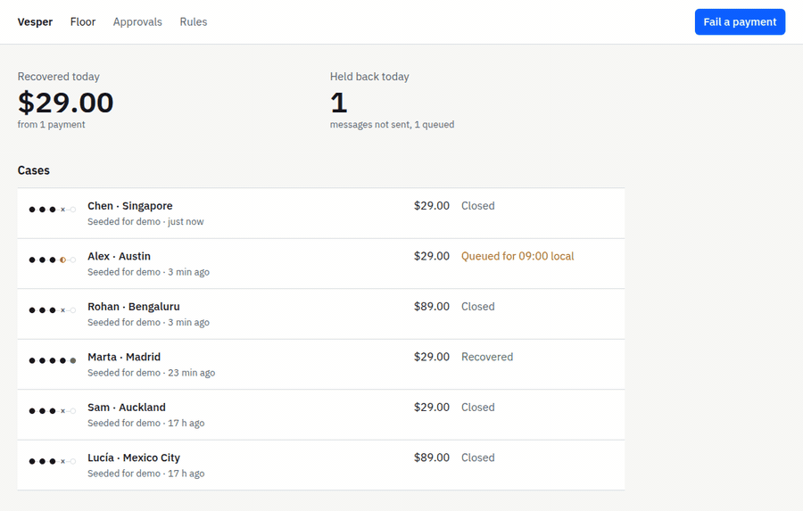

# Vesper

**When a PayPal payment fails, Vesper brings the customer back to pay, and it is never allowed to touch their money.**

Stripe merchants have had failed-payment recovery for years: Smart Retries and a whole category of dunning tools. PayPal merchants have almost nothing, so a declined card is usually a customer who wanted to pay and never hears from the store again. Vesper is the recovery layer PayPal merchants never had.



**Live demo:** https://vesper-web-jilz.onrender.com (sandbox only; the first visit after a quiet spell can take about a minute while the free instance wakes)

## The idea in one rule

Language models hallucinate, which is why fintech teams don't let them near money. Vesper's answer is enforced in code: **the model proposes, deterministic code disposes.**

- The model is called exactly twice per case, once to diagnose and once to propose. Then it is out of the loop.
- It can choose only from four actions: send an invoice, wait, hand to a human, or do nothing. None carries an amount; its output schemas have no numeric fields at all.
- It writes the message as a template with slots. Every name, amount and date is inserted by code from the record PayPal provided.
- Eight rules in plain code check every proposal before anything happens: hard failures are not chased, pending payments only wait, consent is required, messages go out only between 09:00 and 20:00 in the customer's own time zone, at most two messages per case, frozen or refunded orders close, amounts at or above $500 wait for a person, and the message must pass a safety check or be replaced by a standard template.
- Vesper never charges anyone. Its only outbound action is a PayPal invoice the customer may choose to pay.

## Try it (judges)

1. Open the [live demo](https://vesper-web-jilz.onrender.com). You land on the Floor.
2. Press **Fail a payment** and choose **Subscription renewal**. Within about 20 seconds a new case appears and moves through Diagnosed, Proposed and Checked.
3. Open it. You'll see Claude's diagnosis, its proposal, all eight verdicts, and the message in the customer's language.
4. If the invoice was sent, open **Open the PayPal invoice** and pay it as the sandbox buyer below. The case turns **Recovered** through PayPal's webhook, and the number on the Floor goes up.
5. Optional: open [`/demo/store`](https://vesper-web-jilz.onrender.com/demo/store), leave **Make this payment fail** ticked, and check out as the sandbox buyer. PayPal returns a real `INSTRUMENT_DECLINED` and Vesper opens a case from it.

Sandbox buyer (PayPal sandbox only, created for this project, rotated after judging):

- Email: `sb-lk5z253198683@personal.example.com`
- Password: provided in the submission form

Which customer a press produces rotates through six demo customers in different time zones, so you'll also see invoices queued for 09:00 local, an opted-out customer left alone, and hard failures closed without contact. Cases at or above $500 wait on the **Approvals** screen.

## Features

- **Floor**: two numbers (Recovered today, Held back today) and every case with a five-step progress indicator, updating live.
- **Case**: what happened, what Vesper proposed, the eight checks with a reason each, the exact message, and an append-only timeline.
- **Approvals**: approve or decline cases at or above the threshold. Approving re-checks timing and limits before sending, and a double click cannot send twice.
- **Rules**: the eight rules in plain English.
- **Kill switch**: `KILL_SWITCH=true` stops all sending while diagnosis and checks keep running.
- **Store**: a one-product checkout with PayPal buttons and a forced-decline toggle.

## Tools used, and how

| Tool | How Vesper uses it |
|---|---|
| **PayPal Orders v2** | The demo store creates and captures orders. A forced decline uses PayPal's sandbox negative-testing header (`PayPal-Mock-Response`), so the failure is PayPal's, not a mock. |
| **PayPal Invoicing v2** | The only customer-facing channel. Vesper creates the invoice with the amount read from the case record, puts the validated message in the invoice note, and PayPal emails it. |
| **PayPal Webhooks** | Every event is verified with `verify-webhook-signature` before anything runs, and de-duplicated by event id. `INVOICING.INVOICE.PAID` is what turns a case Recovered. |
| **Claude (Anthropic API)** | `claude-opus-5-5` with structured JSON output for the two calls, then strict Pydantic validation with one retry; a second failure escalates the case. Server-side refusal fallback is on. |
| **Render** | API (FastAPI) and web (Next.js) services plus Postgres 17, from [`render.yaml`](render.yaml). |
| **Postman** | [`postman/vesper.postman_collection.json`](postman/vesper.postman_collection.json): ten requests against the live demo, no credentials needed. |

The PayPal Agent Toolkit is planned for Phase 2 as read-only context inside the propose call and is not in this build; a test asserts nothing imports it until it lands with its allowlist.

## Run it locally

```sh
git clone https://github.com/u7k4rs6/vesper && cd vesper/api
cp .env.example .env                              # sandbox app keys, buyer email, Anthropic key
uv sync && uv run alembic upgrade head && uv run python -m scripts.seed_demo
uv run uvicorn vesper.main:app --reload           # API on :8000
LLM_PROVIDER=fixture uv run pytest -q             # 122 tests, no network
cd ../web && cp .env.example .env.local           # same DASHBOARD_TOKEN, PayPal client ID
npm install && npm run dev                        # web on :3000
cd ../api && uv run python -m scripts.e2e_sandbox # optional: one full loop against the real sandbox
```

For webhooks locally, expose `:8000` with a tunnel and run `uv run python -m scripts.register_webhook` with `PUBLIC_API_URL` set.

## Safety, and how it's enforced

Every guarantee above is a test, not a promise. The contract is the table in [`docs/04_SECURITY.md`](docs/04_SECURITY.md) §6, and CI fails if any of its tests is renamed or deleted. A few of them:

| Test | Guarantees |
|---|---|
| `test_output_schemas_have_no_numeric_fields` | the model cannot emit an amount |
| `test_no_pipeline_function_accepts_an_amount` | amounts come only from PayPal's data |
| `test_hallucinated_soft_cannot_unlock_hard_failure` | rules trust PayPal's error code, not the model's opinion |
| `test_llm_called_from_two_sites_only` | two calls, then out |
| `test_no_capture_outside_demo_store` | Vesper never charges |
| `test_kill_switch_blocks_all_sends` | the stop works |
| `test_webhook_without_valid_signature_is_rejected` | no spoofed events |

CI runs the suite on SQLite and on Postgres 17, as deployed.

## Scope, stated honestly

- **Sandbox only.** There is no live PayPal host anywhere in the API, and startup refuses any `PAYPAL_ENV` other than `sandbox`. A live mode would be a separate, reviewed change.
- **No certification claimed.** No card data ever reaches Vesper, so it claims no PCI scope, and it claims no compliance certification of any kind.
- **The demo button seeds its cases** ("Seeded for demo"). PayPal's simulated webhook events reuse one event id per type, which Vesper's de-duplication correctly drops after the first. Everything after the failure is live: Claude, the rules, the PayPal invoice and the payment webhook. The Store's forced decline is a real PayPal failure end to end.
- **The model's diagnosis can be wrong.** What Vesper guarantees is that a wrong one cannot cost money, cannot contact anyone outside the rules, and is shown to the merchant with its reasoning.

Every decision that departed from the original specs is logged with its reason in [`docs/CHANGES.md`](docs/CHANGES.md). The specs themselves are in [`docs/`](docs).

## License

[MIT](LICENSE)
